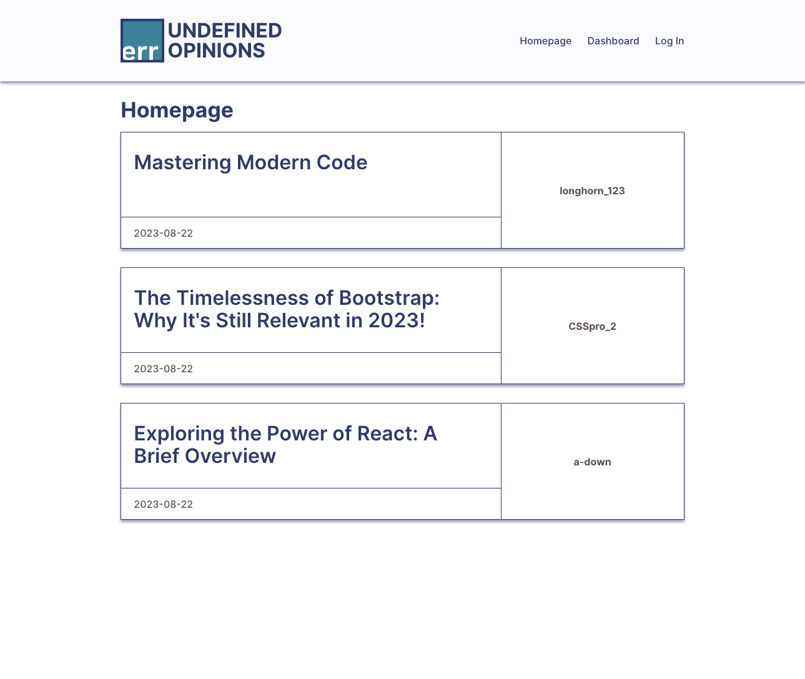
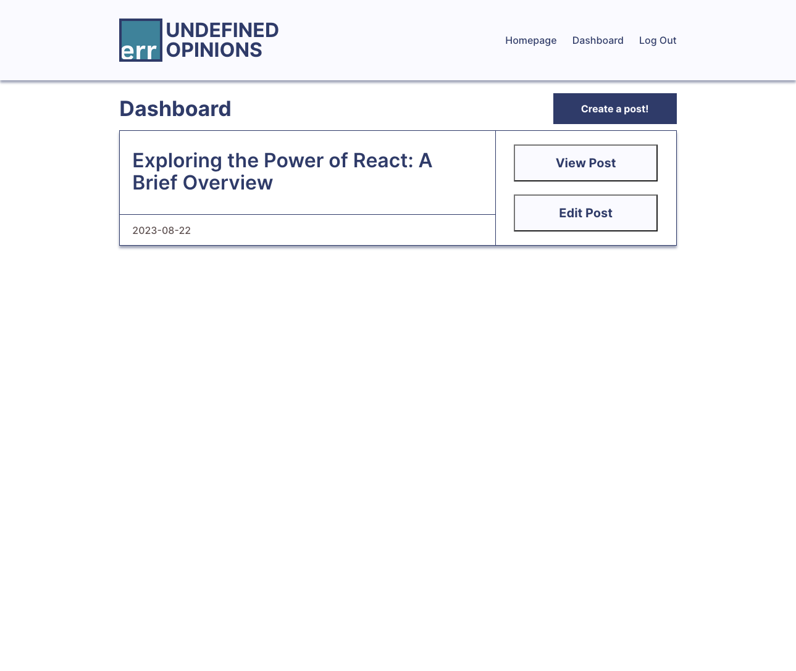
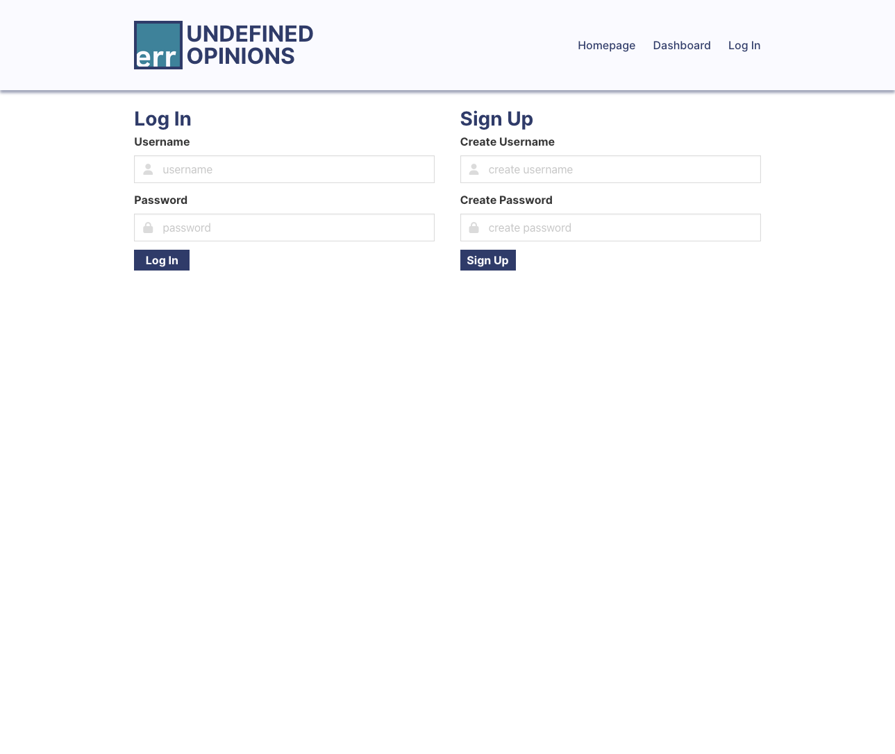
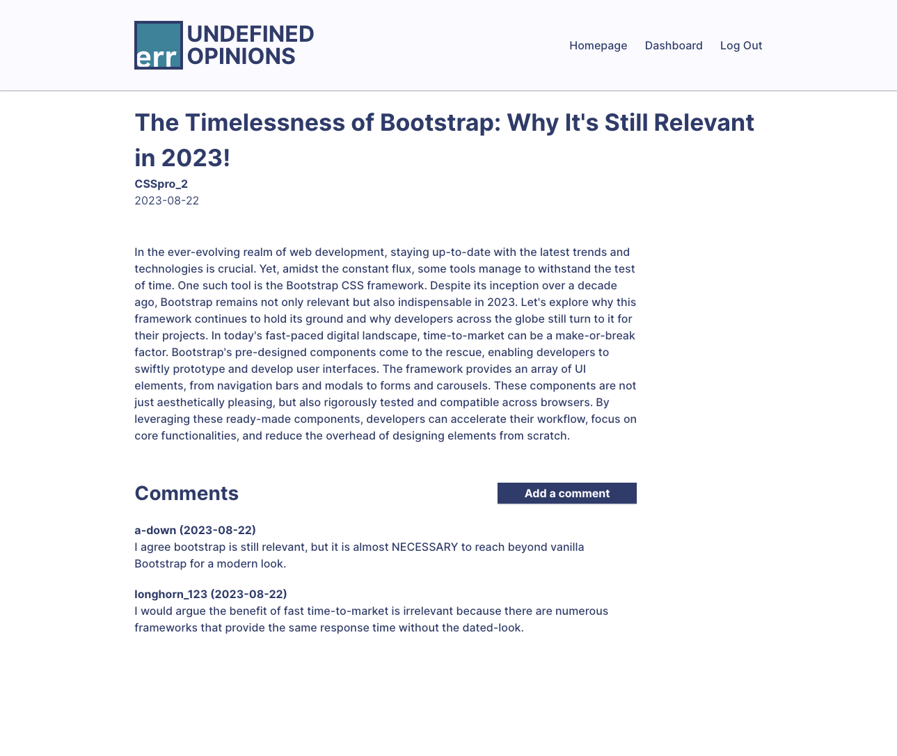

# Undefined Opinions (Module 14 Homework - MVC)

The goal was to create a tech blog site where developers can go to learn and interact with the community. The requirements were:
  - the user will be presented with the homepage when loading the page, which will display all posts on the tech blog
  - the nav links will bring the user to the corresponding pages
  - the `dashboard` and `log in` links will bring the user to sign in
  - the user can sign up with a username and password
  - the `sign up` button saves the user credentials and signs the user into the site
  - the user can sign into the site at a later date with the same credentials
  - when signed in, the `log in` link becomes `log out`
  - the user can click on a blog post card to see the post title, contents, post creator's username, and date created, as well as any comments and the option to leave a comment if signed in
  - the `dashboard` presents any blog posts created by the user and the option to add a blog post, edit a post, or delete a post
  - the user can add a blog post by providing a `title` and `contents`
  - clicking on the `create post` button will publish the post and bring the user to the dashboard
  - the `log out` link will sign the user out of the site
  - when the user idle on the site (10 minute timeout), then user user will need to sign in to add, update, or delete on the site

## Visual Examples

### Homepage

### Dashboard

### Login Page

### View Post

### Write Post

### Edit Post

## Deployed Application (Heroku)

[Deployed Application on Heroku](https://a-down-tech-blog-b6cbf85bb984.herokuapp.com/)

